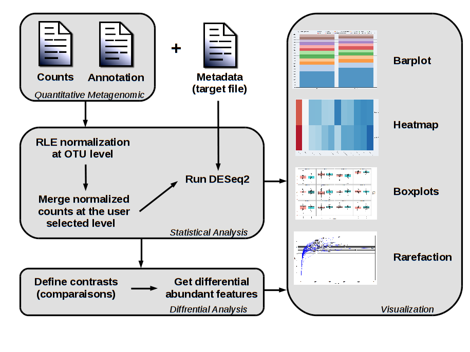

# SHAMAN: a SHiny Application for Metagenomics ANalysis
[Amine Ghozlane](https://research.pasteur.fr/fr/member/amine-ghozlane/) (amine.ghozlane@pasteur.fr) (@xealf8)
[Stevenn Volant](https://research.pasteur.fr/fr/member/stevenn-volant/) (stevenn.volant@pasteur.fr)  


## Contents

- [Introduction](#introduction)
- [Installation](#installation)
- [Citation](#citation)
- [Contact](#contact)
- [Acknowledgements](#acknowledgements)

## Introduction

SHAMAN is dedicated to metagenomic analysis, it includes the normalization, the differential analysis and mutiple visualization.  
SHAMAN is based on DESeq2 R package [Anders and Huber 2010](http://www.ncbi.nlm.nih.gov/pubmed/20979621) for the analysis of metagenomic data, as suggested in [McMurdie and Holmes 2014](http://www.ncbi.nlm.nih.gov/pmc/articles/PMC3974642/) and [Jonsson2016](http://www.ncbi.nlm.nih.gov/pmc/articles/PMC4727335/).
SHAMAN robustly identifies the differential abundant genera with the Generalized Linear Model implemented in DESeq2 [Love 2014](http://www.ncbi.nlm.nih.gov/pubmed/25516281).
Resulting p-values are adjusted according to the Benjamini and Hochberg procedure [Benjamini and Hochberg 1995].
The PCOA is performed with the ade4 R package and plots are generated with ggplot2 or D3.js packages.
A presentation about SHAMAN is available [here](www/shaman_presentation.pdf).  
SHAMAN is compatible with standard formats for metagenomic analysis. We also provide a complete pipeline for OTU picking and annotation named [MASQUE](https://github.com/aghozlane/masque) used in production at Institut Pasteur.  
Hereafter is the global workflow of the SHAMAN application:  


## Installation

SHAMAN is available for R>3.1.2. The installation, download and execution can all be performed with a small R script :
```
# Load shiny packages
if(!require('shiny')){
 install.packages('shiny')
 library(shiny)
}

# Install dependencies, download last version of SHAMAN from github and run shaman in one command :
runGitHub('aghozlane/shaman')
```
This script can also be executed as following : 
```
chmod +x ./shaman/www/shamanapp.R && Rscript ./shaman/www/shamanapp.R
```

## Citation

If you use SHAMAN for your project, please cite our first application of SHAMAN in Quereda et al. 2016.
Publication using SHAMAN :  
- Diverse laboratory colonies of Aedes aegypti harbor the same adult midgut bacterial microbiome. Dickson LB, Ghozlane A, Volant S, Bouchier C, Ma L, Vega-Rúa A, Dusfour I, Jiolle D, Paupy C, Mayanja MN, Kohl A, Lutwama JJ, Duong V, Lambrechts L; Parasit Vectors 2018 [PUBMED](https://www.ncbi.nlm.nih.gov/pubmed/29587819").
- Characteristics of Fecal Microbiota in Pediatric Crohn’s Disease and Their Dynamic Changes During Infliximab Therapy.", href="https://www.ncbi.nlm.nih.gov/pubmed/29194468"), "Wang Y, Gao X, Ghozlane A, Hu H, Li X, Xiao Y, Li D, Yu G, Zhang T; Journal of Crohn's & colitis  2017",style = "font-family: 'times'; font-si16pt"),
- Carryover effects of larval exposure to different environmental bacteria drive adult trait variation in a mosquito vector.", href="https://www.ncbi.nlm.nih.gov/pubmed/28835919"), "Dickson LB, Jiolle D, Minard G, Moltini-Conclois I, Volant S, Ghozlane A, Bouchier C, Ayala D, Paupy C, Moro CV, Lambrechts L; Science Advances 2017",style = "font-family: 'times'; font-si16pt"),
- A bacteriocin from epidemic Listeria strains alters the host intestinal microbiota to favor infection.", href="http://www.ncbi.nlm.nih.gov/pubmed/27140611"), "Quereda JJ, Dussurget O, Nahori MA, Ghozlane A, Volant S, Dillies MA, Regnault B, Kennedy S, Mondot S, Villoing B, Cossart P, Pizarro-Cerda J.; PNAS 2016",style = "font-family: 'times'; font-si16pt"),
- Reporting bugs, ask for help",style = "font-family: 'times'; font-si18pt; font-style: strong"),
- If you have any comments, questions or suggestions, or need help to use SHAMAN, please contact us at", a("shaman@pasteur.fr", href="mailto:shaman@pasteur.fr"),"and please provide us with enough information that we can recreate the problem. Useful things to include are:", style = "font-family: 'times'; font-si16pt;"),
                   
Input data (or examples, a small test case sufficient to recreate the problem)"), 
Information about which system your are using: web version, docker or R installation")

No papers about SHAMAN have been published yet, but a manuscript is in preparation.  
Publication using SHAMAN :  
  
- A bacteriocin from epidemic Listeria strains alters the host intestinal microbiota to favor infection. Quereda JJ, Dussurget O, Nahori MA, Ghozlane A, Volant S, Dillies MA, Regnault B, Kennedy S, Mondot S, Villoing B, Cossart P, Pizarro-Cerda J.; PNAS 2016 [PUBMED](http://www.ncbi.nlm.nih.gov/pubmed/27140611).


## Contact

If you have any comments, questions or suggestions, or need help to use SHAMAN, please contact authors [here](shaman@pasteur.fr).

## Acknowledgements

The main contributors to SHAMAN:
Stevenn Volant, (Initiator, coding, testing, documentation, evaluation),
Amine Ghozlane, (Coding, testing, documentation, evaluation, packaging),
Pierre Lechat (Coding, testing, feature suggestions)  

Thanks to the following people for patches and other suggestions for improvements:  
Carine Rey, Hugo Varet, Julien Tap, Anna Zhukova

