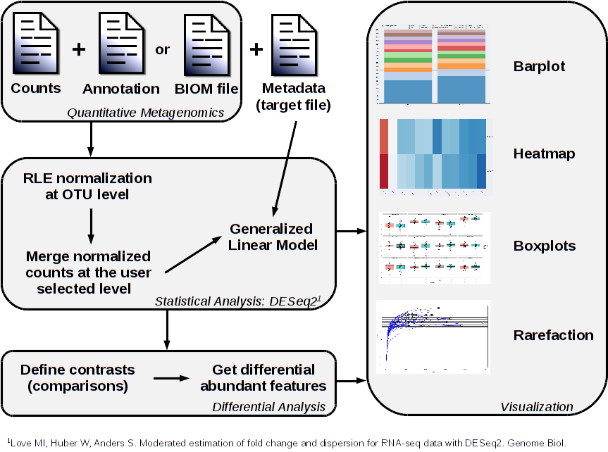

# SHAMAN: a SHiny Application for Metagenomics ANalysis
[Amine Ghozlane](https://research.pasteur.fr/fr/member/amine-ghozlane/) (amine.ghozlane@pasteur.fr) (@xealf8)
[Stevenn Volant](https://research.pasteur.fr/fr/member/stevenn-volant/) (stevenn.volant@pasteur.fr)  


## Contents

- [Introduction](#introduction)
- [Installation](#installation)
- [Citation](#citation)
- [Contact](#contact)
- [Acknowledgements](#acknowledgements)

## Introduction

SHAMAN is a shiny application for differential analysis of metagenomic data (16S, 18S, 23S, 28S, ITS and WGS) including bioinformatics treatment of raw reads for targeted metagenomics, statistical analysis and results visualization with a large variety of plots (barplot, boxplot, heatmap, …).  
The bioinformatics treatment is based on Vsearch [[Rognes 2016](http://www.ncbi.nlm.nih.gov/pubmed/27781170)] which showed to be both accurate and fast [[Wescott 2015](http://www.ncbi.nlm.nih.gov/pubmed/26664811)].The statistical analysis is based on DESeq2 R package [[Anders and Huber 2010](http://www.ncbi.nlm.nih.gov/pubmed/20979621)] which robustly identifies the differential abundant features as suggested in  [[McMurdie and Holmes 2014](http://www.ncbi.nlm.nih.gov/pmc/articles/PMC3974642/)] and [[Jonsson2016](http://www.ncbi.nlm.nih.gov/pmc/articles/PMC4727335/)].
SHAMAN robustly identifies the differential abundant genera with the Generalized Linear Model implemented in DESeq2 [[Love 2014](http://www.ncbi.nlm.nih.gov/pubmed/25516281)].  
SHAMAN is compatible with standard formats for metagenomic analysis (.csv, .tsv, .biom) and figures can be downloaded in several formats.
A presentation about SHAMAN is available [here](www/shaman_presentation.pdf) and a poster [here](www/shaman_poster.pdf).
Hereafter is the global workflow of the SHAMAN application:  


## Installation

SHAMAN is available for R 3.6.1. Here are different ways to install the application:

### Docker install

Docker install is the easiest way to use SHAMAN locally. First, install docker:
- Install docker on ubuntu (Linux): https://docs.docker.com/engine/installation/linux/ubuntulinux/
- Install docker on Windows and Mac: https://www.docker.com/

Now in your terminal:
```
docker pull aghozlane/shaman && docker run --rm -p 80:80 -p 5438:5438 aghozlane/shaman
```
Then connect to http://0.0.0.0/ with your favorite web navigator.
Failed: port is already allocated ?
```
docker run --rm -p 3838:80 -p 5438:5438 aghozlane/shaman
```
Then connect to http://0.0.0.0:3838/.
Docker update after an update of SHAMAN:
```
docker pull aghozlane/shaman
```

### R install with packrat (linux only)

SHAMAN is available for R=3.6.1. Packrat framework allows an easy installation of all the dependencies. Of note, raw data submission is not possible with this version.
```
# Download packrat package
wget ftp://shiny01.hosting.pasteur.fr/pub/shaman_package_202009.tar.gz
mkdir packrat/
```
Now you can run R:
```
install.packages("devtools")
devtools::install_github("rstudio/packrat")
packrat::unbundle("shaman_package_202009.tar.gz", "packrat/")
packrat::init("packrat/shaman")
system("Rscript -e 'shiny::runGitHub("pierreLec/KronaRShy",port=5438)'",wait=FALSE),
shiny::runGitHub('aghozlane/shaman')
```

### R install (deprecated)

R install will require Gfortran on mac (https://cran.r-project.org/bin/macosx/tools/) and Rtools on windows (https://cran.r-project.org/bin/windows/Rtools/index.html). 
Of note, raw data submission is not possible with this version.The installation, download and execution can all be performed with a small R script :
```
# Load shiny packages
if(!require('shiny')){
 install.packages('shiny')
 library(shiny)
}

# Install dependencies, download last version of SHAMAN from github and run shaman in one command :
runGitHub('aghozlane/shaman')
```
This script can also be executed as following : 
```
chmod +x ./shaman/www/shaman.R && Rscript ./shaman/www/shaman.R
```

### CONDA

Conda installation of SHAMAN is available for linux and mac. It can be performed as follow:
```
# Download and install SHAMAN
conda install -c aghozlane shaman
# Now run shaman
shaman_conda.R
```
Then connect to http://0.0.0.0/.

## Citation

If you use SHAMAN for your project, please cite the following publication:  
SHAMAN: a user-friendly website for metataxonomic analysis from raw reads to statistical analysis Volant S, Lechat P, Woringer P, Motreff L, Campagne P, Malabat C, Kennedy S, Ghozlane A; BMC Bioinformatics 2020 Aug 10;21(1):345. [PUBMED](https://pubmed.ncbi.nlm.nih.gov/32778056/)  
Publication using SHAMAN :  
- Prediction of the intestinal resistome by a three-dimensional structure-based method, Ruppé E, Ghozlane A, Tap J, et al.;Nature microbiology 2018 [PUBMED](https://www.ncbi.nlm.nih.gov/pubmed/30478291)
- Combined bacterial and fungal intestinal microbiota analyses: Impact of storage conditions and DNA extraction protocols, Angebault C, Ghozlane A, Volant S, Botterel F, d’Enfert C, Bougnoux ME, PloS one 2018 [PUBMED](https://www.ncbi.nlm.nih.gov/pubmed/30074988)
 - Clinical Efficacy and Microbiome Changes Following Fecal Microbiota Transplantation in Children With Recurrent Clostridium Difficile Infection, Li X, Gao X, Hu H, Xiao Y, Li D, Yu G, Yu D, Zhang T, Wang Y, Frontiers in Microbiology [PUBMED](https://www.ncbi.nlm.nih.gov/pubmed/26566371)                                                                                       
- Diverse laboratory colonies of Aedes aegypti harbor the same adult midgut bacterial microbiome. Dickson LB, Ghozlane A, Volant S, Bouchier C, Ma L, Vega-Rúa A, Dusfour I, Jiolle D, Paupy C, Mayanja MN, Kohl A, Lutwama JJ, Duong V, Lambrechts L; Parasit Vectors 2018 [PUBMED](https://www.ncbi.nlm.nih.gov/pubmed/29587819").
- Characteristics of Fecal Microbiota in Pediatric Crohn’s Disease and Their Dynamic Changes During Infliximab Therapy., Wang Y, Gao X, Ghozlane A, Hu H, Li X, Xiao Y, Li D, Yu G, Zhang T; Journal of Crohn's & colitis  2017 [PUBMED](https://www.ncbi.nlm.nih.gov/pubmed/29194468)
- Carryover effects of larval exposure to different environmental bacteria drive adult trait variation in a mosquito vector, Dickson LB, Jiolle D, Minard G, Moltini-Conclois I, Volant S, Ghozlane A, Bouchier C, Ayala D, Paupy C, Moro CV, Lambrechts L; Science Advances 2017 [PUBMED](https://www.ncbi.nlm.nih.gov/pubmed/28835919) 
- A bacteriocin from epidemic Listeria strains alters the host intestinal microbiota to favor infection. Quereda JJ, Dussurget O, Nahori MA, Ghozlane A, Volant S, Dillies MA, Regnault B, Kennedy S, Mondot S, Villoing B, Cossart P, Pizarro-Cerda J.; PNAS 2016 [PUBMED](http://www.ncbi.nlm.nih.gov/pubmed/27140611).

If you have any comments, questions or suggestions, or need help to use SHAMAN, contact us at [shaman@pasteur.fr](mailto:shaman@pasteur.fr), and provide us with enough information that we can recreate the problem. Useful things to include are:
- Input data
- Error message from SHAMAN
- Key number


## Contact

If you have any comments, questions or suggestions, or need help to use SHAMAN, please contact authors [here](shaman@pasteur.fr).

## Acknowledgements

The main contributors to SHAMAN:
Stevenn Volant (Initiator, coding, testing, documentation, evaluation),
Amine Ghozlane (Coding, testing, documentation, evaluation, packaging),
Perrine Woringer (Coding, testing, documentation, feature suggestions),
Pierre Lechat (Coding, testing, feature suggestions)  

Thanks to the following people for patches and other suggestions for improvements:  
Carine Rey, Valentin Marcon, Hugo Varet, Julien Tap, Anna Zhukova

